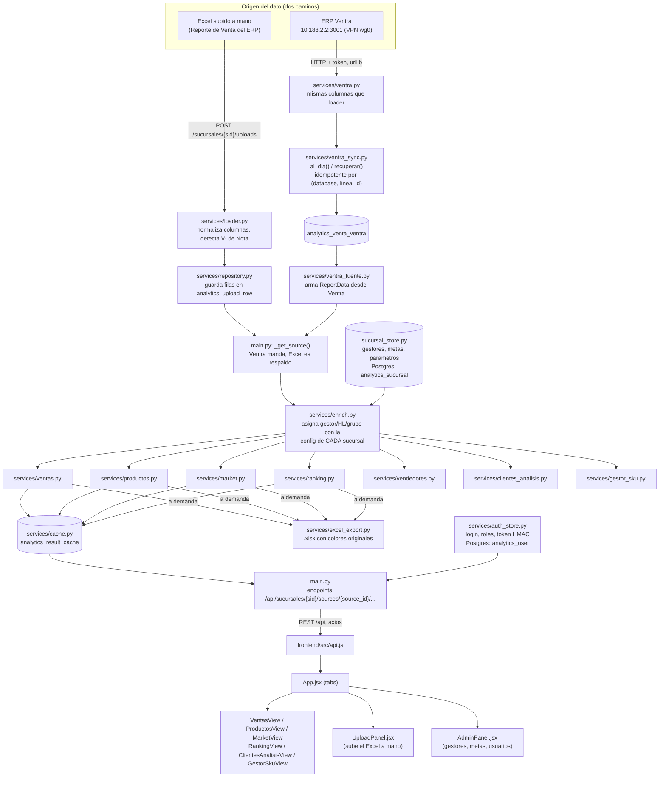

# Mapa interno — analitics

**Qué es.** Dashboard web (FastAPI + React) que reproduce, sucursal por sucursal, los
informes gerenciales de PROCOVAR (Ventas por gestor, Productos, Market, Parranda,
Ranking) que antes salían de un puñado de scripts Python sueltos
(`automatizar_ventas.py`, `automatizar_productos.py`, `automatizar_market.py`,
`automatizar_parranda.py`, `make_ranking.py`). El problema que resuelve: esos cálculos
vivían en scripts que había que correr a mano contra un Excel exportado del sistema de
ventas, sin login, sin multi-sucursal y sin metas editables. La app deja el mismo
cálculo y el mismo formato de colores, pero servido por API, con roles por usuario, y
ahora con **dos** formas de meter el dato crudo en vez de una.

## Diagrama

## Piezas

| Pieza | Dónde vive | De qué se ocupa |
|---|---|---|
| `loader.py` | `app/backend/services/loader.py` | Normaliza el Excel crudo (una hoja, encabezado fila 4), saca el segmento `V-` de la columna Nota. No conoce la sucursal. |
| `repository.py` | `app/backend/services/repository.py` | Guarda las filas del Excel subido en Postgres (`analytics_upload_row`), sin las columnas derivadas; las recalcula al leer. |
| `ventra.py` | `app/backend/services/ventra.py` | Llama a la API de Ventra (HTTP, `urllib`, token) y deja el mismo set de columnas que `loader.py`. |
| `ventra_sync.py` | `app/backend/services/ventra_sync.py` | Trae de Ventra y persiste en `analytics_venta_ventra`; `al_dia()` para lo reciente, `recuperar()` para histórico mes a mes. Idempotente por `(database, linea_id)`. |
| `ventra_sucursales.py` | `app/backend/services/ventra_sucursales.py` | Tabla fija sucursal de analitics → base de Ventra (no coincide por nombre; Moa/Palma Soriano/Las Tunas van aparte). |
| `ventra_fuente.py` | `app/backend/services/ventra_fuente.py` | Arma un `ReportData` desde `analytics_venta_ventra`, igual que si viniera de un Excel subido. |
| `enrich.py` | `app/backend/services/enrich.py` | Con la config de cada sucursal (gestores/alias/factores), agrega gestor, hectolitros, grupo comercial y pallets al DataFrame crudo. |
| `sucursal_store.py` | `app/backend/services/sucursal_store.py` | Config dinámica por sucursal: gestores, metas, parámetros, overrides mensuales. Postgres `analytics_sucursal`. |
| `auth_store.py` | `app/backend/services/auth_store.py` | Usuarios, login, roles (`admin`/`analitico`/`supervisor`/...), tokens HMAC. Postgres `analytics_user`. |
| `ventas.py`, `productos.py`, `market.py`, `ranking.py`, `vendedores.py`, `clientes_analisis.py`, `gestor_sku.py` | `app/backend/services/` | Un módulo de cálculo por informe, sobre el DataFrame ya enriquecido. |
| `excel_export.py` | `app/backend/services/excel_export.py` | Genera los `.xlsx` con el mismo formato y colores que los scripts originales. |
| `cache.py` | `app/backend/services/cache.py` | Guarda el resultado ya calculado por sucursal en `analytics_result_cache`; invalida por huella de la config/datos, no por tiempo. |
| `main.py` | `app/backend/main.py` | Rutas FastAPI. `_get_source()` decide Ventra-vs-Excel; expone `/api/sucursales/{sid}/sources/{source_id}/...`. |
| `db.py` | `app/backend/services/db.py` | Modelos SQLAlchemy (Postgres): `User`, `Sucursal`, `Upload`, `UploadRow`, `VentaVentra`, `ResultCache`, `Ajuste`. |
| `App.jsx` + `components/*View.jsx` | `app/frontend/src/` | Tabs del dashboard, uno por informe; consumen `/api` vía `api.js`. |
| `UploadPanel.jsx` | `app/frontend/src/components/UploadPanel.jsx` | Sube el Excel a mano (el otro origen de datos, visible al usuario). |
| `AdminPanel.jsx` | `app/frontend/src/components/AdminPanel.jsx` | CRUD de gestores, metas, parámetros y usuarios (habla con `sucursal_store.py` y `auth_store.py`). |

## Fronteras

- **ERP Ventra**: HTTP a `10.188.2.2:3001/api/external-api` (variable `VENTRA_API_URL`),
  con token (`VENTRA_API_TOKEN`), solo desde `services/ventra.py`. Esa IP cae en la red
  `10.188.2.0/24` del túnel `procovar` (`wg0`) descrito en el CLAUDE.md general — Ventra
  está al otro lado de esa VPN, y `ventra.py` lo trata explícitamente como algo que se
  puede caer (`VentraNoDisponible`, timeout de 60s). Nunca pagina: se trae por meses.
- **Excel a mano**: no es una frontera de red, es un `UploadFile` por HTTP normal contra
  `/api/sucursales/{sid}/uploads`; el archivo en sí no se guarda, solo las filas.
- **Postgres**: única base de datos, vía `services/db.py` (SQLAlchemy). Tablas
  `analytics_user`, `analytics_sucursal`, `analytics_ajuste`, `analytics_upload`,
  `analytics_upload_row`, `analytics_venta_ventra`, `analytics_result_cache`. Sin ORM
  compartido con otras apps de Procovar: es su propio esquema.
- **Otras apps de Procovar**: no se ha encontrado llamada directa a delivery/PEDIDO
  desde este código (`HANDOFF.md` general del VPS menciona una versión vieja de
  analitics que sí hablaba con la API de PEDIDO y sin base de datos propia; el código
  actual ya no coincide con esa descripción — usa Postgres y Ventra, no PEDIDO).
- **Frontend ↔ backend**: `axios` contra `/api` (mismo origen, proxy Vite en dev / nginx
  en producción según `PROYECTO.md`), token Bearer en cada request.

## Por dónde entrar

1. **`PROYECTO.md`** — el único doc con el porqué de las reglas de negocio (hectolitros,
   pallets, grupos comerciales, comisión, ranking). Sin esto el código de `services/`
   parece aritmética arbitraria.
2. **`app/backend/main.py`** — el mapa de rutas y, sobre todo, `_get_source()`: ahí está
   la decisión real de qué origen de datos gana (Ventra o Excel) para cada informe.
3. **`app/backend/services/loader.py`** — de aquí salen las columnas estables
   (`STD_COLS`) que todo lo demás asume; sin entender esto no se entiende por qué
   `ventra.py` y `repository.py` existen para producir "lo mismo".
4. **`app/backend/services/enrich.py`** — el punto donde el dato crudo (de cualquiera
   de los dos orígenes) se vuelve específico de una sucursal; aquí se ve por qué la
   config es dinámica y no constantes fijas.
5. **`app/backend/services/ventra.py`** — explica en su propio docstring por qué existe,
   contra qué se validó, y qué NO hace (no calcula negocio); es la pieza más nueva y la
   que cambia el proyecto de "sube un Excel" a "automático".
